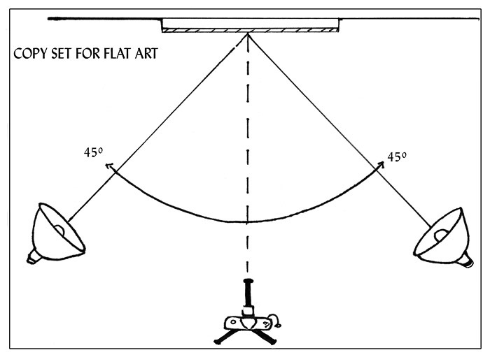
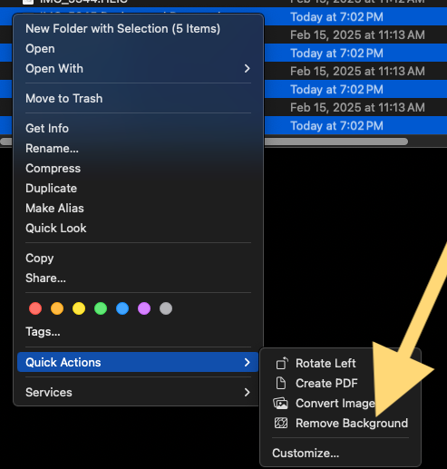
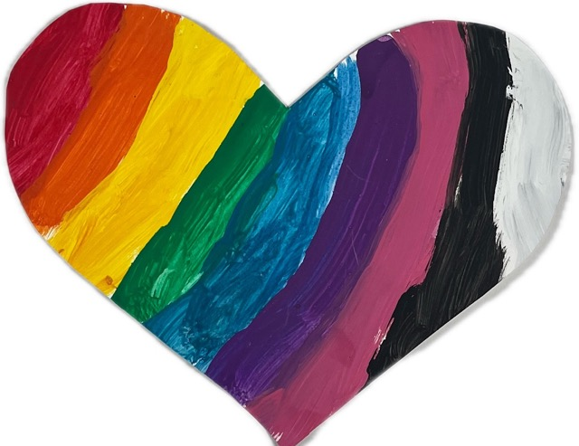

# Kid Copy Work

These are tools I use to do "copy work" of my kid's works. The goals of this project are to:

- Share works with family and friends
- Backup work in case of disaster
- Preserve work that might be fragile
- Reduce storage by recycling some work

Total cost in 2025 dollars $150:

$99 - lights
$22 - phone overhead mount
$60 - any ol' tripod that will mount the overhead mount from the center post

## Prepare a Workspace

First, attach a pocket terminal (e.g. iPhone or Android device) to a tripod via an overhead mount (e.g. [Neweer DS009 Camera Mount](https://www.bhphotovideo.com/c/product/1861081-REG/neewer_66604788_ds009_overhead_camera_mount.html)).

Light the area with two [Nanlite Compac 24B](https://www.bhphotovideo.com/c/product/1664016-REG/nanlite_compac24bdt2k_compac_24b_adjustable_bicolor.html) placed on the ground and lighting at 45° to the work. Use white paperboard as a background.

Trigger the pocket terminal camera with a remote device (e.g. Apple Watch or Bluetooth device).

## Process Photos

Next, AirDrop the photos to me macOS computer.

Now, select the AirDrop'd photos via the "quick action" of "Remove Background".

Move the photos with the backgrounds removed to the `in` directory in this git repo. Then run `python crop.py` which will crop the photos down to the bounding box of the work and add a white background.

At the end you should have a nice clean photo of the work

